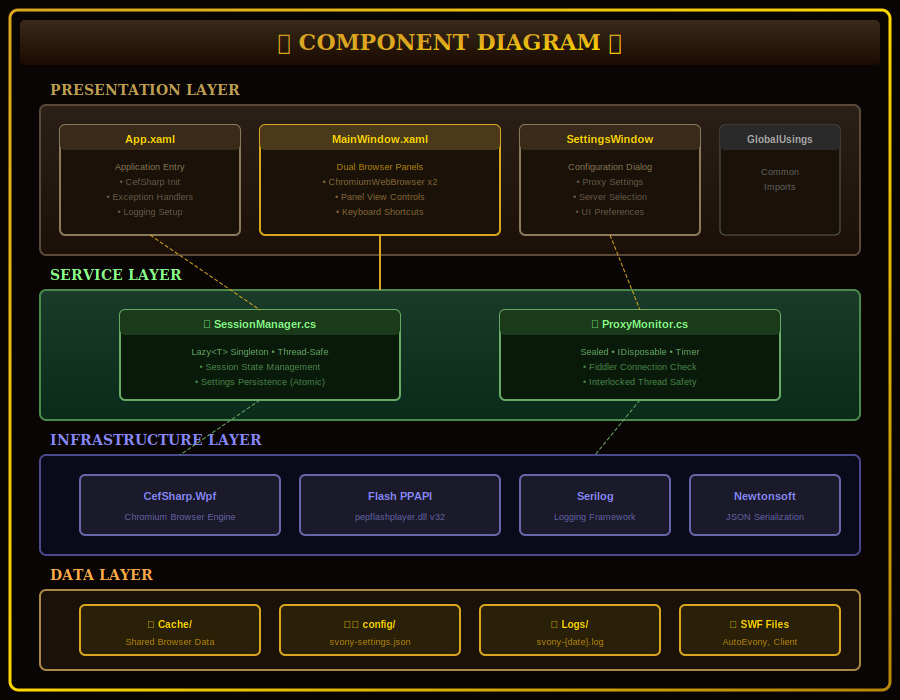
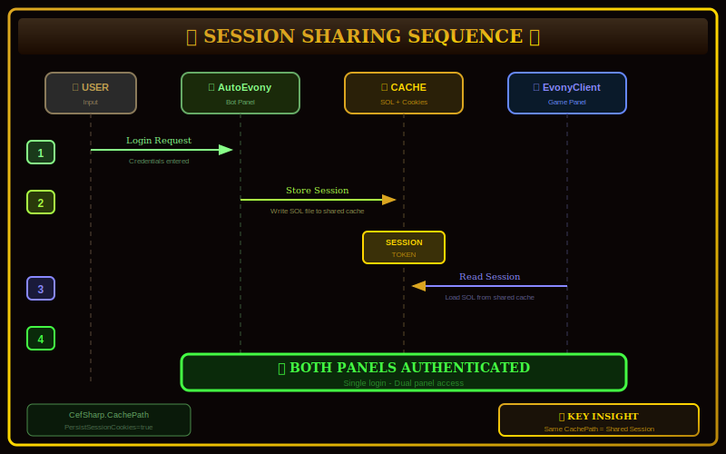
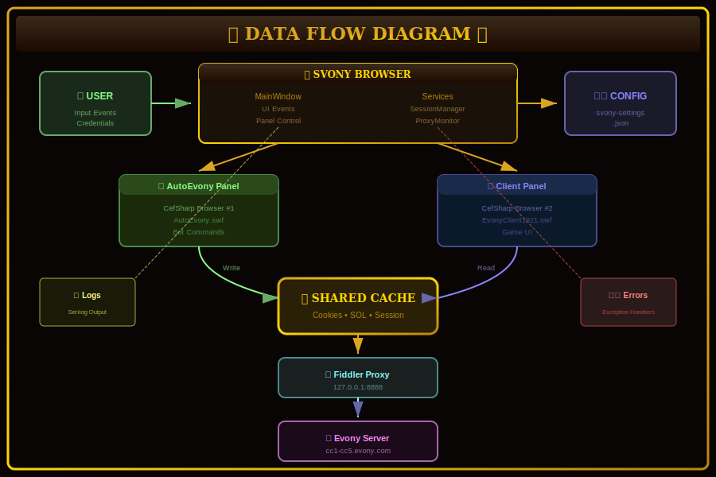
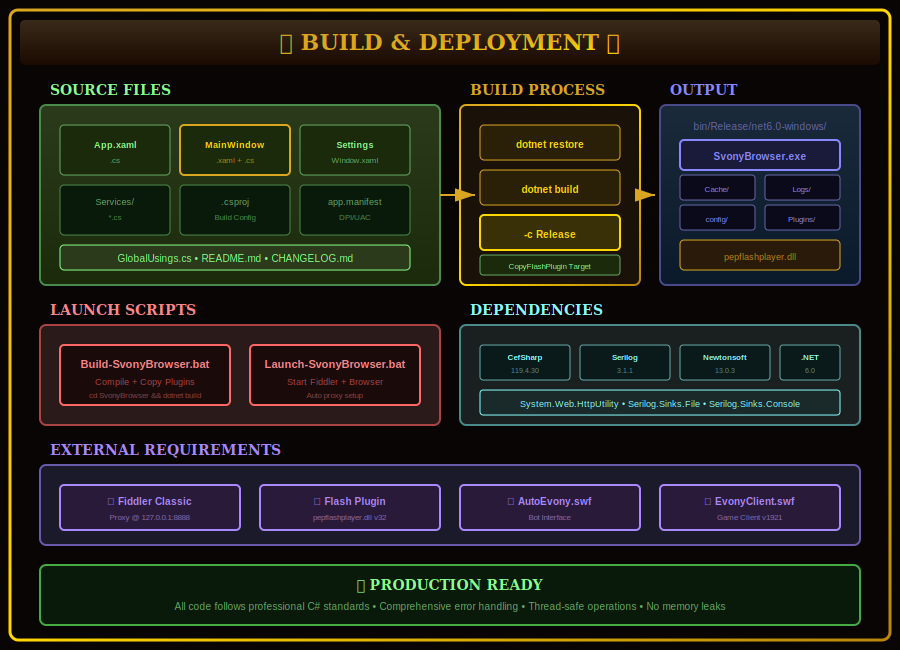

# 🏗️ Svony Browser Architecture

**Complete Technical Documentation**

---

## Table of Contents

1. [Overview](#overview)
2. [System Architecture](#system-architecture)
3. [Component Diagram](#component-diagram)
4. [Session Sharing Mechanism](#session-sharing-mechanism)
5. [Data Flow](#data-flow)
6. [Build & Deployment](#build--deployment)
7. [Key Technologies](#key-technologies)
8. [Configuration](#configuration)
9. [Extension Points](#extension-points)

---

## Overview

Svony Browser is a dual-panel Flash browser that enables simultaneous operation of AutoEvony (bot interface) and EvonyClient (game client) while sharing a single authenticated session.

### Core Innovation

The key architectural insight is that **both CefSharp browser instances share the same cache directory**, which means:
- SOL files (Flash Local Shared Objects) are shared
- Cookies and session tokens are shared
- Login once → Both panels authenticated automatically

### Design Goals

| Goal | Implementation |
|------|----------------|
| Session Sharing | Shared CachePath for both browsers |
| Traffic Capture | Fiddler proxy integration |
| Flexibility | Resizable, swappable, hideable panels |
| Performance | CefSharp with hardware acceleration |
| Maintainability | Clean MVVM-style architecture |

---

## System Architecture


### High-Level Architecture

```
┌─────────────────────────────────────────────────────────────────────────────┐
│                           SVONY BROWSER                                      │
├─────────────────────────────────────────────────────────────────────────────┤
│                                                                              │
│  ┌─────────────────────────────────────────────────────────────────────┐    │
│  │                         TOOLBAR                                      │    │
│  │  [◀ Bot] [Both] [Client ▶] [⇄ Swap] │ Server: [cc2 ▼] │ [Tools]     │    │
│  └─────────────────────────────────────────────────────────────────────┘    │
│                                                                              │
│  ┌──────────────────────┐   ┌──────────────────────────────────────────┐    │
│  │   🤖 AUTOEVONY BOT   │ ║ │      🎮 EVONY CLIENT                     │    │
│  │                      │ ║ │                                          │    │
│  │  CefSharp Browser #1 │◄╬►│  CefSharp Browser #2                     │    │
│  │  AutoEvony.swf       │ ║ │  EvonyClient1921.swf                     │    │
│  │                      │ ║ │                                          │    │
│  └──────────────────────┘ ║ └──────────────────────────────────────────┘    │
│         GridSplitter ═════╝                                                  │
│                                                                              │
│  ┌─────────────────────────────────────────────────────────────────────┐    │
│  │                       STATUS BAR                                     │    │
│  │  ● Connected │ Ready │ Proxy: 127.0.0.1:8888 ✓ │ Session: Shared    │    │
│  └─────────────────────────────────────────────────────────────────────┘    │
│                                                                              │
└─────────────────────────────────────────────────────────────────────────────┘
                                     │
                    ┌────────────────┼────────────────┐
                    │                │                │
            ┌───────▼───────┐ ┌──────▼──────┐ ┌──────▼──────┐
            │ SHARED CACHE  │ │   FIDDLER   │ │  EVONY SVR  │
            │ SOL + Cookies │ │    PROXY    │ │ cc2.evony   │
            └───────────────┘ └─────────────┘ └─────────────┘
```

### Layer Architecture

| Layer | Components | Responsibility |
|-------|------------|----------------|
| **Presentation** | MainWindow, SettingsWindow | UI, user interaction |
| **Application** | SessionManager, ProxyMonitor | Business logic, state management |
| **Infrastructure** | CefSharp, Fiddler | Browser rendering, network proxy |
| **Data** | Cache, Config, Logs | Persistence, configuration |

---

## Component Diagram



### WPF Application Components

```
SvonyBrowser/
├── App.xaml                    # Application entry, resources
│   └── App.xaml.cs             # CefSharp initialization
│
├── MainWindow.xaml             # Split panel layout
│   └── MainWindow.xaml.cs      # Panel controls, keyboard shortcuts
│
├── SettingsWindow.xaml         # Settings dialog
│   └── SettingsWindow.xaml.cs  # Settings I/O
│
└── Services/
    ├── SessionManager.cs       # Session state, settings
    └── ProxyMonitor.cs         # Fiddler connection monitoring
```

### Component Responsibilities

| Component | Purpose |
|-----------|---------|
| **App** | Initialize CefSharp with shared cache, configure Flash plugin |
| **MainWindow** | Host two ChromiumWebBrowser controls with GridSplitter |
| **SettingsWindow** | Configure server, proxy, UI preferences |
| **SessionManager** | Manage session state, server selection, settings persistence |
| **ProxyMonitor** | Monitor Fiddler proxy availability, emit status events |

---

## Session Sharing Mechanism



### The Key Insight

Both CefSharp browsers share the same `CachePath`:

```csharp
var settings = new CefSettings
{
    CachePath = Path.Combine(AppDomain.CurrentDomain.BaseDirectory, "Cache"),
    PersistSessionCookies = true,
    PersistUserPreferences = true
};
```

### What Gets Shared

| Data Type | Location | Purpose |
|-----------|----------|---------|
| **SOL Files** | Cache/Pepper Data/Shockwave Flash/ | Flash persistent storage |
| **Cookies** | Managed by CefSharp RequestContext | Session authentication |
| **Session Token** | Stored in SOL files | Server authentication |

### Authentication Flow

```
1. User logs in via AutoEvony (or EvonyClient)
2. Server returns session token
3. AutoEvony stores token in SOL file + cookie
4. EvonyClient loads from same cache location
5. EvonyClient finds existing session
6. EvonyClient auto-authenticates with stored token
7. Both panels now share the same session!
```

### Code Implementation

```csharp
// In App.xaml.cs - Shared cache initialization
var settings = new CefSettings
{
    // CRITICAL: Both browsers use same cache
    CachePath = Path.Combine(AppDomain.CurrentDomain.BaseDirectory, "Cache"),
    PersistSessionCookies = true,
    PersistUserPreferences = true
};

// Proxy for traffic capture
settings.CefCommandLineArgs.Add("proxy-server", "127.0.0.1:8888");

// Flash plugin for SWF support
settings.CefCommandLineArgs.Add("ppapi-flash-path", flashPluginPath);
settings.CefCommandLineArgs.Add("ppapi-flash-version", "32.0.0.465");
```

---

## Data Flow



### Traffic Flow

```
User Input
    │
    ├──► AutoEvony Panel ──┐
    │                      │
    └──► EvonyClient Panel ─┼──► Shared Cache
                           │         │
                           │         ▼
                           │    Fiddler Proxy
                           │    (127.0.0.1:8888)
                           │         │
                           │         ▼
                           └──► Evony Server
                                (cc2.evony.com)
                                     │
                                     ▼
                              Response Back
                                     │
                              ┌──────┴──────┐
                              ▼             ▼
                         AutoEvony    EvonyClient
                          Update        Update
```

### Packet Types (via Fiddler)

| Type | Keywords | Color |
|------|----------|-------|
| LOGIN | login, auth | Green |
| MARCH | march, troop | Orange |
| BATTLE | battle, attack | Red |
| BUILD | build, upgrade | Purple |
| CHAT | chat, message | Yellow |
| AMF | 0x00 0x03 magic | Amber |

---

## Build & Deployment



### Prerequisites

- Windows 10/11 (x64)
- .NET 6.0 SDK
- Visual C++ Redistributable 2019+

### Build Steps

```powershell
# 1. Navigate to project
cd D:\Fiddler-FlashBrowser

# 2. Build
.\Build-SvonyBrowser.bat
# Or manually:
cd SvonyBrowser
dotnet restore
dotnet build -c Release

# 3. Launch
.\Launch-SvonyBrowser.bat
# Or with options:
.\Launch-SvonyBrowser.ps1 -Server cc3 -Build
```

### Output Structure

```
SvonyBrowser/bin/Release/net6.0-windows/
├── SvonyBrowser.exe          # Main executable
├── SvonyBrowser.dll          # Main assembly
├── CefSharp.*.dll            # Browser engine
├── libcef.dll                # Chromium core
├── Plugins/
│   └── pepflashplayer.dll    # Flash plugin
├── Cache/                    # Shared browser cache
├── Logs/                     # Application logs
└── config/                   # Settings files
```

---

## Key Technologies

### CefSharp (Chromium Embedded Framework)

- **Version**: 119.4.30
- **Purpose**: Render Flash SWF files in WPF
- **Key Feature**: Shared RequestContext for session sharing

```xml
<PackageReference Include="CefSharp.Wpf" Version="119.4.30" />
<PackageReference Include="CefSharp.Common" Version="119.4.30" />
```

### Flash Player (PPAPI)

- **Version**: 32.0.0.465
- **Purpose**: Execute Flash SWF content
- **Location**: Plugins/pepflashplayer.dll

### Fiddler Classic

- **Purpose**: HTTP/HTTPS proxy for traffic capture
- **Port**: 8888 (default)
- **Features**: Packet classification, AMF decoding, SWF extraction

### Serilog

- **Purpose**: Structured logging
- **Sinks**: File (rolling), Console

```xml
<PackageReference Include="Serilog" Version="3.1.1" />
<PackageReference Include="Serilog.Sinks.File" Version="5.0.0" />
```

---

## Configuration

### Settings File: `config/svony-settings.json`

```json
{
  "DefaultServer": "cc2.evony.com",
  "ProxyHost": "127.0.0.1",
  "ProxyPort": 8888,
  "AutoStartFiddler": true,
  "RememberPanelLayout": true,
  "LeftPanelWidth": 0.5,
  "LastPanelMode": "Both",
  "EnableLogging": true,
  "Theme": "Dark"
}
```

### Configuration Schema

| Setting | Type | Default | Description |
|---------|------|---------|-------------|
| DefaultServer | string | cc2.evony.com | Default game server |
| ProxyHost | string | 127.0.0.1 | Fiddler proxy host |
| ProxyPort | int | 8888 | Fiddler proxy port |
| AutoStartFiddler | bool | true | Auto-launch Fiddler |
| RememberPanelLayout | bool | true | Persist panel state |
| EnableLogging | bool | true | Enable debug logging |

---

## Extension Points

### Adding New Panels

To add a third panel, modify `MainWindow.xaml`:

```xml
<Grid.ColumnDefinitions>
    <ColumnDefinition x:Name="LeftColumn" Width="*"/>
    <ColumnDefinition Width="Auto"/>
    <ColumnDefinition x:Name="MiddleColumn" Width="*"/>  <!-- NEW -->
    <ColumnDefinition Width="Auto"/>
    <ColumnDefinition x:Name="RightColumn" Width="*"/>
</Grid.ColumnDefinitions>
```

### Custom Fiddler Rules

Extend `EvonyRE-CustomRules.cs` for custom packet handling:

```csharp
public static void OnBeforeRequest(Session oSession)
{
    // Custom packet detection
    if (oSession.fullUrl.Contains("customEndpoint"))
    {
        oSession["ui-color"] = "#FF00FF";  // Magenta
    }
}
```

### Adding Services

Create new services in `Services/`:

```csharp
namespace SvonyBrowser.Services;

public class CustomService
{
    private static CustomService? _instance;
    public static CustomService Instance => _instance ??= new CustomService();
    
    public event Action<string>? OnCustomEvent;
    
    // Implementation...
}
```

---

## Diagrams Index

| Diagram | File | Description |
|---------|------|-------------|
| Logo | [svony-logo.svg](diagrams/svony-logo.svg) | Application logo |
| Architecture | [architecture-overview.svg](diagrams/architecture-overview.svg) | Full system overview |
| Components | [component-diagram.svg](diagrams/component-diagram.svg) | Component relationships |
| Session Flow | [session-sharing-flow.svg](diagrams/session-sharing-flow.svg) | Authentication sequence |
| Data Flow | [data-flow.svg](diagrams/data-flow.svg) | Network traffic flow |
| Build | [build-deployment.svg](diagrams/build-deployment.svg) | Build process |

---

## Related Documentation

- [README.md](../README.md) - Quick start guide
- [EVONY_PROTOCOL_REFERENCE.md](../../docs/EVONY_PROTOCOL_REFERENCE.md) - Game protocol details
- [IMPLEMENTATION_GUIDE.md](../../docs/IMPLEMENTATION_GUIDE.md) - Step-by-step implementation

---

## Version History

| Version | Date | Changes |
|---------|------|---------|
| 1.0.0 | 2025-01-12 | Initial release |

---

*Svony Browser - Making Evony automation accessible*


---

## v3.0 - v6.0 Architecture Extensions

### Service Layer (v3.0+)

The service layer was significantly expanded in v3.0-v6.0 to support advanced features:

```
SvonyBrowser/Services/
├── Core Services
│   ├── McpConnectionManager.cs      # MCP server connections
│   ├── ProtocolHandler.cs           # AMF3 encoding/decoding
│   ├── GameStateEngine.cs           # Real-time game state
│   ├── ChatbotService.cs            # AI chat integration
│   ├── SessionManager.cs            # Browser session management
│   ├── TrafficPipeClient.cs         # Fiddler named pipe
│   └── ProxyMonitor.cs              # Proxy status monitoring
│
├── Analysis Services
│   ├── PacketAnalysisEngine.cs      # Deep packet analysis
│   ├── ProtocolFuzzer.cs            # Protocol fuzzing
│   ├── CombatSimulator.cs           # Battle simulation
│   ├── StrategicAdvisor.cs          # AI strategy
│   ├── MapScanner.cs                # World map discovery
│   └── AnalyticsDashboard.cs        # Performance analytics
│
├── Automation Services
│   ├── AutoPilotService.cs          # Intelligent automation
│   ├── SessionRecorder.cs           # Session recording
│   ├── MultiAccountOrchestrator.cs  # Multi-account
│   ├── CdpConnectionService.cs      # Chrome DevTools Protocol
│   ├── VisualAutomationService.cs   # Coordinate automation
│   └── PromptTemplateEngine.cs      # AI prompts
│
└── Infrastructure Services
    ├── SettingsManager.cs           # Settings persistence
    ├── MemoryManager.cs             # Memory management
    ├── ErrorHandler.cs              # Error handling
    ├── ConnectionPool.cs            # Connection pooling
    ├── ThemeManager.cs              # Theme management
    ├── KeyboardShortcutManager.cs   # Keyboard shortcuts
    ├── RealDataProvider.cs          # Live data
    ├── WebhookHub.cs                # Webhooks
    ├── ExportImportManager.cs       # Data portability
    ├── FiddlerBridge.cs             # Fiddler integration
    ├── LlmIntegrationService.cs     # LLM integration
    └── StatusBarManager.cs          # Status bar widgets
```

### MCP Server Architecture (v3.0+)

```
mcp-servers/
├── evony-rag/           # Port 3001 - RAG knowledge base
│   ├── index.js
│   └── package.json
│
├── evony-rte/           # Port 3002 - Real-time traffic
│   ├── index.js
│   ├── amf-codec.js
│   ├── protocol-db.js
│   └── package.json
│
├── evony-tools/         # Port 3003 - Utility tools
│   ├── index.js
│   └── package.json
│
├── evony-advanced/      # Port 3004 - Advanced features
│   ├── index.js
│   └── package.json
│
├── evony-v4/            # Port 3005 - v4.0 status bar
│   ├── index.js
│   └── package.json
│
├── evony-complete/      # Port 3006 - Complete CLI
│   ├── index.js
│   └── package.json
│
└── evony-cdp/           # Port 3007 - CDP browser control
    ├── index.js
    └── package.json
```

### UI Components (v3.0+)

```
SvonyBrowser/Controls/
├── ChatbotPanel.xaml/.cs        # AI co-pilot chat
├── TrafficViewer.xaml/.cs       # Traffic monitoring
├── ProtocolExplorer.xaml/.cs    # Protocol browser
├── StatusBar.xaml/.cs           # Basic status bar
├── StatusBarV4.xaml/.cs         # Advanced status bar
├── StatusBarWidgetControl.xaml/.cs  # Widget control
└── PacketBuilder.xaml/.cs       # Visual packet builder
```

### Singleton Pattern

All services use the lazy singleton pattern for thread safety:

```csharp
public sealed class ServiceName : IDisposable
{
    private static readonly Lazy<ServiceName> _lazyInstance =
        new(() => new ServiceName(), LazyThreadSafetyMode.ExecutionAndPublication);

    public static ServiceName Instance => _lazyInstance.Value;

    private ServiceName() { /* initialization */ }
}
```

### Event-Driven Architecture

Services communicate via events:

```csharp
// Publisher
public event EventHandler<PacketEventArgs>? PacketReceived;
protected virtual void OnPacketReceived(PacketEventArgs e)
    => PacketReceived?.Invoke(this, e);

// Subscriber
service.PacketReceived += (s, e) => HandlePacket(e.Packet);
```

### Configuration System (v6.0)

```
Settings Hierarchy:
1. Default Settings (hardcoded in AppSettings.cs)
2. User Settings (settings.json)
3. Environment Variables
4. Command Line Arguments

File Locations:
- %APPDATA%/SvonyBrowser/settings.json
- %APPDATA%/SvonyBrowser/recordings/
- %APPDATA%/SvonyBrowser/logs/
```

### Memory Management (v6.0)

```csharp
// MemoryManager monitors and optimizes memory usage
MemoryManager.Instance.StartMonitoring();

// Automatic GC hints during idle
MemoryManager.Instance.OnMemoryPressure += (s, e) =>
{
    if (e.PressureLevel > 0.8)
        GC.Collect(2, GCCollectionMode.Optimized);
};
```

### Error Handling (v6.0)

```csharp
// Centralized error handling
ErrorHandler.Instance.HandleException(ex, ErrorSeverity.Warning);

// Automatic crash recovery
ErrorHandler.Instance.EnableCrashRecovery();
```

---

## Version-Specific Features

### v3.0 Features
- 10 new core services
- evony-advanced MCP server
- PacketBuilder control
- 25+ MCP tools

### v4.0 Features
- Advanced status bar with 25+ widgets
- Deep packet analysis engine
- Protocol fuzzer
- Local LLM integration
- Fiddler bridge

### v5.0 Features
- 168 CLI commands
- evony-complete MCP server
- IDE configurations
- Full browser control via CLI

### v6.0 Features
- 164 configurable settings
- Settings Control Center
- Memory management
- Error handling
- Theme manager
- Keyboard shortcuts
- Real data providers

---

*Last Updated: v6.0 "Borg Edition"*
