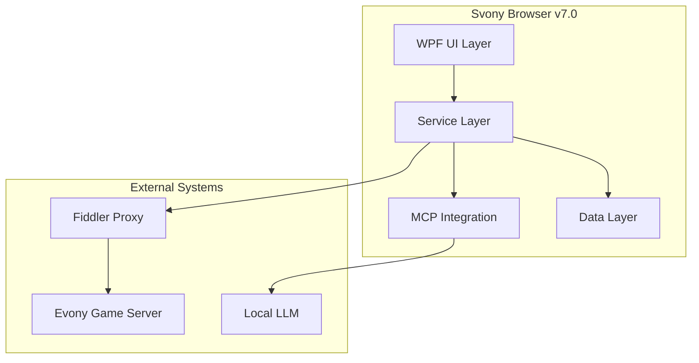

# Svony Browser v7.0 - Diagrams Index

## Overview

This document provides an index of all architectural diagrams, schematics, blueprints, and visual documentation for Svony Browser v7.0.

## Diagram Categories

### 1. System Architecture Diagrams

| Diagram | File | Description |
|---------|------|-------------|
| System Architecture | `v7-system-architecture.mmd/png` | Complete system overview |
| Data Flow | `v7-data-flow.mmd/png` | Data flow between components |
| MCP Architecture | `v7-mcp-servers.mmd/png` | MCP server structure |
| UI Components | `v7-ui-components.mmd/png` | UI component hierarchy |

### 2. Testing Diagrams

| Diagram | File | Description |
|---------|------|-------------|
| Testing Flow | `v7-testing-flow.mmd/png` | Test execution pipeline |
| CI/CD Pipeline | `v7-cicd-pipeline.mmd/png` | Continuous integration flow |
| Playwright Architecture | `v7-playwright-architecture.mmd/png` | Test automation structure |

### 3. Service Diagrams

| Diagram | File | Description |
|---------|------|-------------|
| Service Architecture | `service-architecture.mmd/png` | Service layer design |
| Data Flow v6 | `data-flow-v6.mmd/png` | v6 data flow |
| MCP Architecture | `mcp-architecture.mmd/png` | MCP integration |

## Diagram Locations

All diagrams are located in:
```
SvonyBrowser/docs/diagrams/
```

## Rendered Diagrams

### System Architecture


### Data Flow


### Testing Flow


### CI/CD Pipeline


### MCP Servers


### UI Components


### Playwright Architecture


## Diagram Source Files

All diagrams are created using Mermaid syntax for easy maintenance:

### Example: System Architecture



## Regenerating Diagrams

To regenerate all diagrams:

```bash
cd SvonyBrowser/docs/diagrams
for f in *.mmd; do
  manus-render-diagram "$f" "${f%.mmd}.png"
done
```

## Diagram Standards

### Naming Convention
- `v7-{category}-{name}.mmd` - Mermaid source
- `v7-{category}-{name}.png` - Rendered PNG

### Color Scheme
- Primary: `#1a1a2e` (Dark blue)
- Secondary: `#16213e` (Navy)
- Accent: `#0f3460` (Blue)
- Highlight: `#e94560` (Red)
- Success: `#00ff88` (Green)

### Typography
- Title: Bold, 16pt
- Labels: Regular, 12pt
- Annotations: Italic, 10pt

## Blueprint Documents

### UI Layout Blueprint
```
┌─────────────────────────────────────────────────────────────┐
│ Menu Bar                                                     │
├─────────────────────────────────────────────────────────────┤
│ Toolbar                                                      │
├─────────────────────────┬───────────────────────────────────┤
│                         │                                    │
│   Left Browser Panel    │     Right Browser Panel           │
│   (Main Game View)      │     (Secondary View)              │
│                         │                                    │
│                         │                                    │
├─────────────────────────┴───────────────────────────────────┤
│ Chatbot Panel / Traffic Viewer / Protocol Explorer          │
├─────────────────────────────────────────────────────────────┤
│ Status Bar [RAG] [RTE] [LLM] [Packets] [Fiddler] [Power]   │
└─────────────────────────────────────────────────────────────┘
```

### Service Layer Blueprint
```
┌─────────────────────────────────────────────────────────────┐
│                     Service Layer                            │
├─────────────────────────────────────────────────────────────┤
│ ┌─────────────┐ ┌─────────────┐ ┌─────────────┐            │
│ │ GameState   │ │ Protocol    │ │ Chatbot     │            │
│ │ Engine      │ │ Handler     │ │ Service     │            │
│ └─────────────┘ └─────────────┘ └─────────────┘            │
│ ┌─────────────┐ ┌─────────────┐ ┌─────────────┐            │
│ │ AutoPilot   │ │ Session     │ │ Analytics   │            │
│ │ Service     │ │ Recorder    │ │ Dashboard   │            │
│ └─────────────┘ └─────────────┘ └─────────────┘            │
│ ┌─────────────┐ ┌─────────────┐ ┌─────────────┐            │
│ │ MCP         │ │ LLM         │ │ Fiddler     │            │
│ │ Connection  │ │ Integration │ │ Bridge      │            │
│ └─────────────┘ └─────────────┘ └─────────────┘            │
└─────────────────────────────────────────────────────────────┘
```

### MCP Server Blueprint
```
┌─────────────────────────────────────────────────────────────┐
│                     MCP Servers                              │
├─────────────────────────────────────────────────────────────┤
│ ┌─────────────────┐ ┌─────────────────┐ ┌─────────────────┐│
│ │ evony-rag       │ │ evony-rte       │ │ evony-tools     ││
│ │ Port: 3001      │ │ Port: 3002      │ │ Port: 3003      ││
│ │                 │ │                 │ │                 ││
│ │ - RAG queries   │ │ - AMF3 decode   │ │ - Calculations  ││
│ │ - Knowledge     │ │ - Traffic       │ │ - Automation    ││
│ │ - Documentation │ │ - Analysis      │ │ - Utilities     ││
│ └─────────────────┘ └─────────────────┘ └─────────────────┘│
│ ┌─────────────────┐ ┌─────────────────┐ ┌─────────────────┐│
│ │ evony-advanced  │ │ evony-v4        │ │ evony-cdp       ││
│ │ Port: 3004      │ │ Port: 3005      │ │ Port: 3006      ││
│ │                 │ │                 │ │                 ││
│ │ - Combat sim    │ │ - Status bar    │ │ - CDP control   ││
│ │ - Map scanner   │ │ - Packet        │ │ - Visual auto   ││
│ │ - Webhooks      │ │ - LLM tools     │ │ - Screenshots   ││
│ └─────────────────┘ └─────────────────┘ └─────────────────┘│
│ ┌─────────────────────────────────────────────────────────┐│
│ │ evony-complete - Port: 3007                             ││
│ │ 168 tools for full browser control                      ││
│ └─────────────────────────────────────────────────────────┘│
└─────────────────────────────────────────────────────────────┘
```

## Schematic Documents

### Data Flow Schematic
```
User Input → UI Layer → Service Layer → MCP Server → LLM
                ↓              ↓
           Protocol      Game State
           Handler        Engine
                ↓              ↓
           Fiddler ←→ Evony Server
                ↓
           Traffic
           Analysis
                ↓
           Status Bar
           Updates
```

### Authentication Flow
```
1. User starts application
2. Load saved session (if exists)
3. Connect to Evony server
4. Validate session token
5. If invalid → Show login
6. If valid → Load game state
7. Start MCP servers
8. Initialize services
9. Ready for automation
```

### Error Recovery Flow
```
Error Detected
     ↓
Log Error
     ↓
Classify Severity
     ↓
┌────┴────┐
│         │
Low     High
│         │
Retry   Stop AutoPilot
│         │
Success? Notify User
│         │
Continue  Wait for
          Resolution
```

## Version History

| Version | Changes |
|---------|---------|
| v7.0 | Added all v7 diagrams, testing flow, CI/CD pipeline |
| v6.0 | Added service architecture, data flow |
| v4.0 | Added MCP architecture |
| v3.0 | Initial diagrams |
